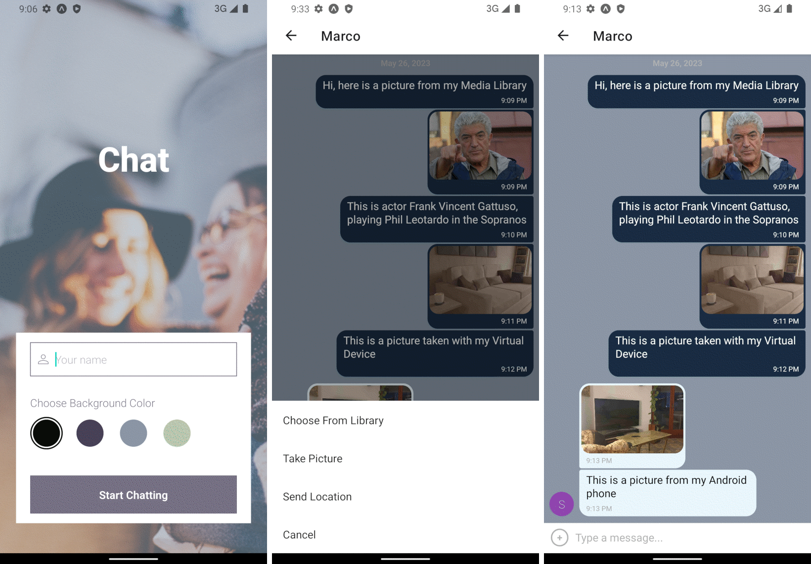

# Chat App

- [Overview](#overview)
- [Key Features](#key-features)
- [Tech Stack](#tech-stack)
- [Project Setup](#project-setup)
  - [Setup Firebase Project](#1-setup-firebase-project)
  - [Setup Android Emulator](#2-setup-android-emulator)
  - [Setup Local Project](#3-setup-local-project)

## Overview

The Chat App allows users to enter a chat room, exchange messages with other users, share locations and images, and read messages offline. It is also compatible with a screen reader for users with visual impairments.

## Key Features

- User-friendly interface: Users can enter their name, choose a theme color, and easily access the chat room.
- Real-time messaging: Users can exchange text messages in real-time.
- Image sharing: With appropriate permissions, users can share images from their device's media library or capture photos using the device camera.
- Location sharing: Users can share their current location with others.
- Offline messaging: Even when offline, users can still read and access previous conversations.
- Screen reader compatibility: The app is designed to be accessible and compatible with screen readers for users with visual impairments.

## Tech Stack

The app is built with the following technologies:

- Node.js 18.16.0
- Expo 48
- React Native 0.71.8
- Firebase ^9.13.0
- TypeScript ^4.9.4

It utilizes the following Firebase services:

- Firebase Authentication for anonymous sign-in
- Firestore Database for storing messages
- Firebase Storage for storing images

The chat interface and functionality are created using [Gifted Chat](https://github.com/FaridSafi/react-native-gifted-chat), a popular and highly customizable React Native library for chat applications.

## Project Setup

### 1. Setup Firebase Project

1. Open the Firebase Console ([https://console.firebase.google.com/](https://console.firebase.google.com/)) and create a new project. Choose a name and proceed. You can uncheck Google Analytics if desired.
2. In the Project Overview, click on the "Add app" button (`</>`) to add a web app.
3. Register your app name.
4. In the "Add Firebase SDK" step, copy the firebase config object from the code box. Create a new file named `firebase.config.ts` and paste the config object after the "export" keyword. Your file should look like this:

```typescript
export const firebaseConfig = {
  apiKey: 'XXXXXXXXXXXXXXXXXXXXXXXXXXXXXXXXXXXXXX',
  authDomain: 'chat-app-XXXXX.firebaseapp.com',
  projectId: 'chat-app-XXXXXXXXX',
  storageBucket: 'chat-app-XXXXXX.appspot.com',
  messagingSenderId: '000000000000000',
  appId: 'XXXXXXXXXXXXXXX',
};
```

5. Save the file, you will need it later.
6. In the Firebase Project Overview, go to the "Build" menu on the left side and choose "Authentication". Click on "Get started" and enable the "Anonymous" sign-in provider. Enable and Save.
7. From the "Build" menu, choose "Firestore Database". Click on "Create Database", select your preferred location and click Enable.
8. In the Cloud Firestore "Rules" tab, set the following rule: `allow read, write: if true;` and publish the changes.
9. From the "Build" menu, choose "Storage". Click on "Get started", then Next and Done.
10. In the Storage "Rules" tab, set the following rule: `allow read, write: if true;` and hit Publish

### 2. Setup Android Emulator

1. Install Android Studio on your local machine.
2. From the Welcome screen, click on "More Actions" and select "SDK Manager".
3. On the "SDK Platforms" tab, check "Show Package Details" in the bottom right corner.
4. Choose an Android Platform Package (Android 12L recommended) and select "Android SDK Platform", "Sources for Android", "Google APIs System Image", and "Google Play System Image" (choose according to your system).
5. In the "SDK Tools" tab, select "Android SDK Build-Tools", "Android Emulator", and "Android SDK Platform Tools".
6. For Mac users: Copy the Android SDK location from the same window and add the following lines to your `.zprofile` or `.zshrc` file:

```bash
export ANDROID_SDK=/YOUR/ANDROID/SDK/LOCATION
export PATH=$ANDROID_SDK/platform-tools:$PATH
```

7. After installing the relevant packages, go back to the Welcome screen, click on "More Actions", and select "Virtual Device Manager".
8. Click on "Create Device" and select a newer device with the Play Store icon. Choose Next.
9. Select a platform. "Sv2" is recommended.
10. In the "Verify Configuration" window, click on "Show Advanced Settings".
11. In the "Memory and Storage" section, change both "Internal Storage" and "SD card" to 4096. Click "Finish".
12. In the Device Manager, start your newly created emulator.

### 3. Setup local project

1. Clone the repository of the Chat App to your local machine.
2. Add your `firebase.config.ts` file to the project's root folder.
3. In the Terminal, navigate to the project's root folder and run the command `npm install`.
4. Run the command `npm start`. The Metro Bundler will open.
5. Choose option `a` for the Android Emulator. The Expo Go app will be installed on the virtual device, and the Chat App will open.
